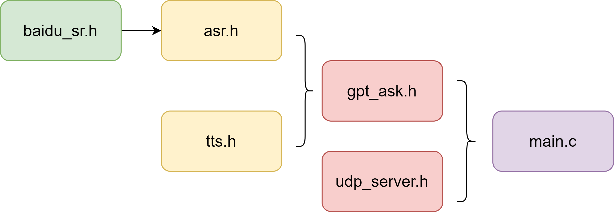
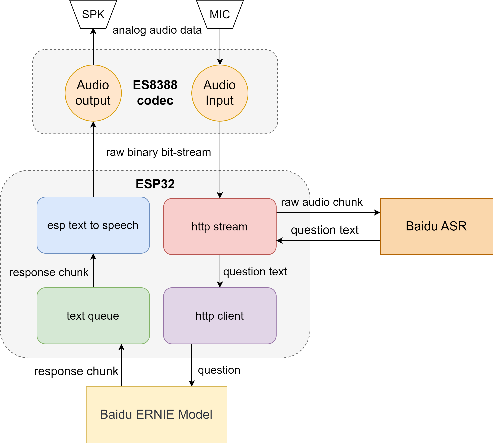
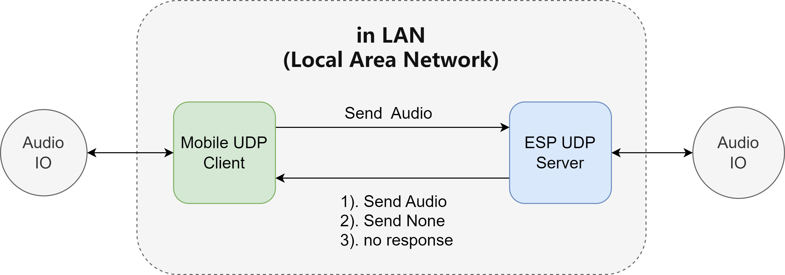

# AI-smart-assistant -- ESP32 software

BUAA  电子信息工程学院  第三届电子信息智能硬件创新大赛  校园网范围内的AI语音助手  帕主任的鹰

> ESP32-software by 张尚谋
> 
> this is just a submodule repo, for the main repo, the link:  [AI-smart-assistant](https://github.com/Ximenzhengmo/AI-smart-assistant)

## 开发环境(development environment)
* **esp-idf**: v4.4.6
* **esp-adf**: v2.6  

## 文件介绍(files introduction)
* **main/** : `.c` source and `.h` header files
* **python_script/** : python scripts for debug or better usage
* **esp32_chatbot_v1/** : board config files, added into `<adf-root>/components/audio_board`
* **esp_tts_voice_data_xiaole.dat** : esp-tts file to write to Flash `voice_data` part in address `0x310000`
* **partitions.csv**: partition table for flash use
* **sdkconfig-template**: a template for sdkconfig, you can remove `-template` to use it in your project directly and we **recommand you do as this** because some items differ from the default sdkconfig choices( such as Flash size, partition table, PSRAM, SPIFLASH, ...).

## 项目配置(project config)
* clone the repo
```bash
git clone https://github.com/Ximenzhengmo/ESP32-chatbot.git
```
* copy `esp32_chatbot_v1` dir to `<adf-root>/components/audio_board/`
* add the following codes in `<adf-root>/components/audio_board/CMakeLists.txt`
```CMake
if (CONFIG_ESP32_CHATBOT_V1_BOARD)
message(STATUS "Current board name is " CONFIG_ESP32_CHATBOT_V1_BOARD)
list(APPEND COMPONENT_ADD_INCLUDEDIRS ./esp32_chatbot_v1)
set(COMPONENT_SRCS
./esp32_chatbot_v1/board.c
./esp32_chatbot_v1/board_pins_config.c
)
endif()
```
* add the following codes in `<adf-root>/components/audio_board/Kconfig.projbuild` in `choice AUDIO_BOARD`
```
config ESP32_CHATBOT_V1_BOARD
    bool "esp32_chatbot_v1"
```
* in file `<adf-root>/components/audio_hal/driver/es8388/es8388.c`
   
  change these tow lines
  ```c
    res |= es_write_reg(ES8388_ADDR, ES8388_DACCONTROL26, 0);
    res |= es_write_reg(ES8388_ADDR, ES8388_DACCONTROL27, 0);
  ```
  to
  ```c
    #ifdef CONFIG_ESP32_CHATBOT_V1_BOARD
    res |= es_write_reg(ES8388_ADDR, ES8388_DACCONTROL26, 0x24);
    res |= es_write_reg(ES8388_ADDR, ES8388_DACCONTROL27, 0x24);
    #else   
    res |= es_write_reg(ES8388_ADDR, ES8388_DACCONTROL26, 0);
    res |= es_write_reg(ES8388_ADDR, ES8388_DACCONTROL27, 0);
    #endif
  ```

* choose `esp32_chatbot_v1` board and other items in config menu, refer to `sdkconfig-template`(default if use template directly)

* flash `esp_tts_voice_data_xiaole.dat` to the partition table `voice_data` address `0x310000`.

* build, flash and monitor. 
## 项目结构(project structure)


| 文件 | 作用 |
| --- | --- |
| baidu_sr.h | 构造了调用百度ASR的基本结构体 |
| asr.h | 实现了ASR的百度语音识别方法 |
| tts.h | 基于esp-adf实现文字转语音方法 |
| gpt_ask.h | 实现了调用文心一言API方法 |
| udp_server.h | 实现了esp32 UDP服务器的方法 |
| main.c | 主程序逻辑 |

## 功能介绍(function introduction)
### 基于百度文心一言大模型的语音助手


该功能实现了智能语音对话。按下rec按钮后，ESP32开始录音，同时将语音流实时发送到百度ASR云端；松开按钮后，录音结束并将识别文本返回给ESP32。ESP32接收到问题文本后，将其转发给百度ERNIE(文心大模型)，并以chunk-stream的形式接收并解析出回应。每解析完一个chunk块后，就将其存入文本队列。ESP-tts依次从队列中接收文本并转化为语音播放。实现了对话的功能。整个流程大致消耗 1s 左右的时间，实现了实时对话。

### 基于校园局域网的 ip 通话


该部分功能在ESP上实现了一个简易的UDP服务器，移动设备通过“帕主任的鹰”APP即可主动发起语音通话。ESP32可以根据当前状态选择回复的模式：

* 1.双向模式(Send Audio)：ESP32收到移动端消息后同时将自身采集的声音发送给移动端
* 2.单项模式(Send None)：ESP32收到移动端消息不会将其消息发送给移动端
* 3.断连(no response)：网络不畅；或者当前正在进行功能一，UDP服务器存在但不工作

## 脚本使用(script usage)
We provide two `python` scripts for better usage or debug

* ESP32_http_debug.py: this script is used for having an insight into the audio-stream recorded and sent to Baidu ASR, if the result of ASR is almost wrong due to some noise. This script creates and serves as a http-transfer-sever between ESP and Baidu Cloud and save the audio-stream in `.wav` file.
* ESP_UDP_Client.py: this script helps you create a UDP client in PC and correspond with ESP-UDP-sever in case you use an iPhone or don't want to use our APP.
